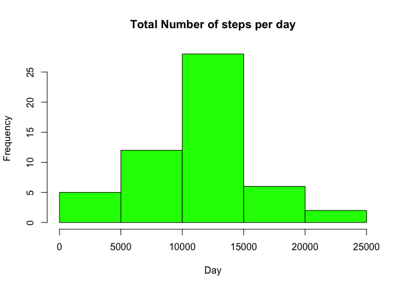
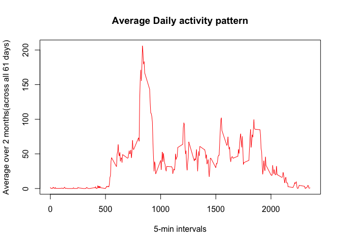
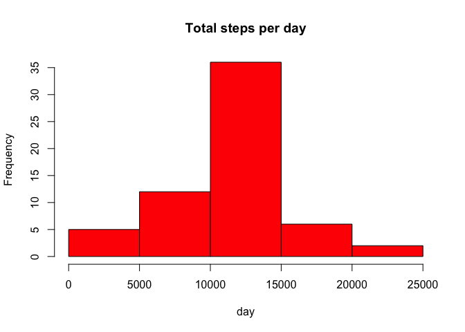

####Coursera: Data Science Specialization
####Course: Reproducible Research
#####Peer Assignment 1: Reproducible Research
###### Date: Jan 10, 2016
##### Submitted by Parthav Jailwala

##### Clear the workspace, set working directory


```r
setwd("~/Documents/DataScience/GitRepos/RepData_PeerAssessment1")
rm(list=ls())
library(lattice)
```

## Loading and preprocessing the data

##### Read in the input data


```r
if(!file.exists('activity.csv')) {
  unzip('repdata_data_activity.zip')
}
# NOTE: The file activity.csv has three columns: steps, Date and Interval. The activity data has been collected at 5 minute intervals for each day. So there are 12 intervals every hour and hence 12 x 24 = 288 intervals each day, and hence for 61 days (Oct & Nov), we will have 288 x 61 = 17568 rows in the file
activityData<-read.csv('activity.csv', colClasses=c("numeric","character","numeric"))
dim(activityData)
```

```
## [1] 17568     3
```

##### Check dimensions of the input data


```r
# NOTE: The file activity.csv has three columns: steps, Date and Interval. The activity data has been collected at 5 minute intervals for each day. So there are 12 intervals every hour and hence 12 x 24 = 288 intervals each day, and hence for 61 days (Oct & Nov), we will have 288 x 61 = 17568 rows in the file
dim(activityData)
```

```
## [1] 17568     3
```

##### Process/transform the data into a format suitable for analysis


```r
activityData$date<-as.Date(activityData$date,"%Y-%m-%d")
```

##### What is mean total number of steps taken per day?

1. Calculate the total number of steps taken per day


```r
# NOTE: Using the aggregate function to sum up all the 288 values of steps per date
TotalSteps <-aggregate(steps ~ date, data=activityData, sum, na.rm=TRUE)
```

2. Make a histogram of the total number of steps taken each day


```r
hist(TotalSteps$steps, main ="Total Number of steps per day", xlab="Day", col="green")
```

 

3. Calculate and report the mean and median of the total number of steps taken per day


```r
mean(TotalSteps$steps)
```

```
## [1] 10766.19
```

```r
median(TotalSteps$steps)
```

```
## [1] 10765
```

##### What is the average daily activity pattern?

1. Make a time series plot (i.e. type = "l") of the 5-minute interval (x-axis) and the average number of steps taken, averaged across all days (y-axis)


```r
timeseries<-tapply(activityData$steps, activityData$interval, mean, na.rm=TRUE)
plot(row.names(timeseries), timeseries, type="l", xlab = "5-min intervals", ylab="Average over 2 months(across all 61 days)", main ="Average Daily activity pattern", col="red")
```

 
2. Which 5-minute interval, on average across all the days in the dataset, contains the maximum number of steps?


```r
maxinterval<-which.max(timeseries)
names(maxinterval)
```

```
## [1] "835"
```

##### Imputing missing values

Note that there are a number of days/intervals where there are missing values (coded as NA). The presence of missing days may introduce bias into some calculations or summaries of the data.

1. Calculate and report the total number of missing values in the dataset (i.e. the total number of rows with NAs)


```r
# Using the is.na function to find rows with NA values
missingActivity<-sum(is.na(activityData))
missingActivity
```

```
## [1] 2304
```

2. Devise a strategy for filling in all of the missing values in the dataset. The strategy does not need to be sophisticated. For example, you could use the mean/median for that day, or the mean for that 5-minute interval, etc.


```r
Avesteps=aggregate(steps~interval, data=activityData, FUN=mean)
NAfill<-numeric()
for (i in 1:nrow(activityData)) {
  obs=activityData[i, ]
  if (is.na(obs$steps)) {
    steps <- subset(Avesteps, interval==obs$interval)$steps
  } else {
    steps<-obs$steps
  }
  NAfill<- c(NAfill, steps)
}
```

3. Create a new dataset that is equal to the original dataset but with the missing data filled in.


```r
new_ActivityData<- activityData
new_ActivityData$steps<- NAfill
```

4. Make a histogram of the total number of steps taken each day and Calculate and report the mean and median total number of steps taken per day. Do these values differ from the estimates from the first part of the assignment? What is the impact of imputing missing data on the estimates of the total daily number of steps?


```r
TotalStepsNew<- aggregate(steps~date, data=new_ActivityData, sum, na.rm =TRUE)
hist(TotalStepsNew$steps, main = "Total steps per day", xlab="day", col="red")
```

 

```r
mean(TotalStepsNew$steps)
```

```
## [1] 10766.19
```

```r
median(TotalStepsNew$steps)
```

```
## [1] 10766.19
```


##### Are there differences in activity patterns between weekdays and weekends?

For this part the weekdays() function may be of some help here. Use the dataset with the filled-in missing values for this part.

1. Create a new factor variable in the dataset with two levels – “weekday” and “weekend” indicating whether a given date is a weekday or weekend day.


```r
day=weekdays(new_ActivityData$date)
daylevel=vector()
for (i in 1:nrow(new_ActivityData)) {
  if (day[i] =="Saturday") {
    daylevel[i] = "Weekend" 
  } else if (day[i]=="Sunday") {
    daylevel[i]="Weekend"
  } else {
    daylevel[i]="Weekday"
  }
}
new_ActivityData$daylevel <- daylevel
new_ActivityData$daylevel <- factor(new_ActivityData$daylevel)
```

2. Make a panel plot containing a time series plot (i.e. type = "l") of the 5-minute interval (x-axis) and the average number of steps taken, averaged across all weekday days or weekend days (y-axis). See the README file in the GitHub repository to see an example of what this plot should look like using simulated data.


```r
stepsByDay <- aggregate(steps~interval + daylevel, data= new_ActivityData, mean)
names(stepsByDay) = c("interval", "daylevel", "steps")
xyplot(steps ~ interval | daylevel, stepsByDay, type = "l", layout = c(1, 2), 
    xlab = "Interval", ylab = "Number of steps")
```

 
